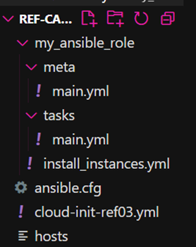

# Dokumentation zu "Ref-Card-3-mit-Ansible-und-MaaS"

Author: Chaimaa El Jarite

## Einleitung
Diese Aufgabe besteht darin eine Automatisierte Installation von Zwei MAAS-Instanzen mithilfe von Ansible Multipass zu machen.

### Ziel der Aufgabe:
  -  Zwei MaaS instanzen: Datenbank und Webserver
  -  JokesDB auf der Datenbank konfigurieren
  -  Schlussendlich soll eine Verbindung der beiden Instanzen erstellt werden, damit man Zugriff auf die Ref-Card-3.0 hat.

### Projektstrucktur
Folgende Komponenten werden in der Aufsetzungs des Projekts gebraucht:
```
- ansible.cfg: um Konfigurationseinstellungen für Ansible zu definieren und anzupassen.

- Cloud-init.yml: um die Instanzen mit definierte Kriterien (mit BBW-Maas) zu erstellen

- hosts: um Hostnamen oder IP-Adressen von Zielsystemen zu definieren, auf denen Ansible-Aufgaben oder Playbooks ausgeführt werden sollen.

- playbook.yml: automatisierte Aufgaben und Konfigurationsschritte für die Ausführung auf Zielsystemen.
```

## Projekt

### Aufsetzung
- Virtuelle Maschinen in der BBW Maas Aufsetzen 


- WireGuard runterladen und Aktivieren


- Installieren von Ansible
```
$ sudo apt update
$ sudo apt install ansible
```


- SSH Key generieren
```
$ ssh-keygen
```


- SSH Public Key anzeigen
```
$ cd /home/user/.ssh
$ cat id_rsa.pub
```


- Ansible Configuration File (ansible.cfg)
```
Ein "ansible.cfg"-Datei wird verwendet, um Konfigurationseinstellungen für Ansible zu definieren und anzupassen.
```


- Hosts File
```
Ein "hosts"-Datei in Ansible wird verwendet, um Hostnamen oder IP-Adressen von Zielsystemen zu definieren, auf denen Ansible-Aufgaben oder Playbooks ausgeführt werden sollen.
```

```
Version 1 hosts -> FALSCH
```


```
Version 2 hosts -> Richtig
```


- Cloud Init File (cloud-init.yml)
```
Ein "cloud-init.yml"-Datei wird genutzt, um automatisierte Konfigurationen für virtuelle Maschinen in Cloud-Umgebungen festzulegen. 

Diese Datei enthält YAML-formatierte Anweisungen, die beim Starten einer VM durch das Cloud-Init-Tool interpretiert werden, um beispielsweise Benutzer, Netzwerkeinstellungen und Skriptausführungen zu konfigurieren.
```


- Virtual Maschine ping

```
Fehler
```


```
Lösung
```


### AUTOMATIZIERUNG - ROLLE VERZEICHNIS


- Make Ansible Role


- main.yml - tasks




- main.yml - meta


- install_instances.yml


- Error bei der erstellung my_ansible_role


